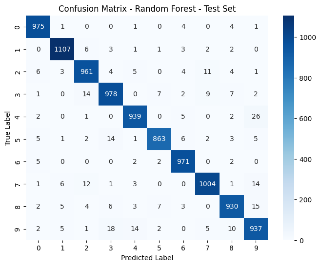

# mnist-digit-classification
Comparison of machine learning models for handwritten digit classification using the MNIST dataset

---

## Overview

This project investigates the performance of various machine learning models on the MNIST handwritten digit dataset.

The dataset consists of 70,000 grayscale images (28x28 pixels) representing digits from 0–9.

---

## Models Implemented

- Logistic Regression
- Linear Discriminant Analysis (LDA)
- Quadratic Discriminant Analysis (QDA)
- Support Vector Machines (Linear & RBF)
- Decision Tree
- Random Forest
- Feedforward Neural Network
- Convolutional Neural Network (CNN)

---

## Key Findings

- CNN achieved the highest accuracy (~99%) but required significant training time (~12 minutes)
- Random Forest provided the best balance between accuracy (~96.6%) and efficiency (~9 seconds)
- Simpler models (e.g. QDA) struggled with visually similar digits

---

## Methodology

1. Data split into training, validation, and test sets using stratified sampling  
2. Standardisation of pixel values to improve model stability  
3. PCA applied (retaining 95% variance, reducing dimensionality from 784 to ~326 features) for selected models  
4. Model training and evaluation using:
   - Accuracy
   - F1-score
   - Training time  
5. Confusion matrices used for error analysis  

---

## Example Result

---

## How to Run

1. Clone the repository  
2. Open the notebook in Jupyter  
3. Ensure required Python packages are installed  
4. Run all cells to reproduce the results  

---

## Tech Stack

- Python  
- scikit-learn  
- NumPy / pandas  
- Matplotlib / seaborn  
- Neural networks (TensorFlow / PyTorch if used)

---

## Summary

This project demonstrates the trade-off between model performance and computational efficiency, highlighting how simpler models such as Random Forest can provide near state-of-the-art performance with significantly lower computational cost compared to more complex models like CNNs.
